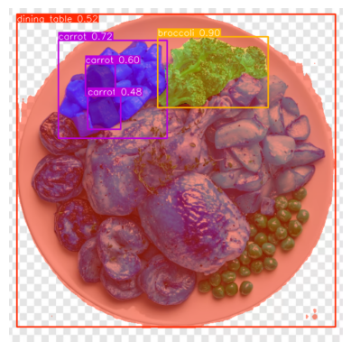

# ClearPlate



Making a computer vision model to detect, identify and estimate the weight of food waste or unfinished food from plates in RC4 dining hall

# Food Waste Detection & Estimation

## The Problem: Inefficient Food Waste Measurement

Manual food waste measurement is a laborious, time-consuming, and often inaccurate process. Existing AI solutions for food detection and waste estimation frequently fall short due to fundamental limitations:

- **Labor-Intensive Labeling:** Traditional computer vision methods often require tedious, pixel-by-pixel polygon labeling for each food item, making data collection and model training extremely slow.
- **Limited Labeling Scope:** Many conventional AI approaches are restricted to assigning only one label per image, making it challenging to identify and quantify multiple distinct food items on a single plate.
- **Scalability Challenges:** The combination of slow labeling and limited multi-item detection makes scaling these solutions across diverse food environments practically unfeasible.

These challenges prevent effective monitoring and intervention strategies for reducing food waste.

## Our Solution: A Fast and Accurate AI-Powered Food Waste Detection Pipeline

We are developing an innovative AI-powered pipeline designed to rapidly detect food waste and accurately estimate the quantity of uneaten food. Our solution provides granular insights, identifying not only the type of food but also its precise quantity (e.g., how many grams of rice or vegetables were wasted from a specific food stall).

Our pipeline leverages cutting-edge AI models and a novel area-ratio estimation technique, structured into a robust, multi-stage process:

### Step 1: Accelerated Image Labeling

To overcome the bottleneck of manual annotation, we employ an automated labeling approach:

- **Meta's Segment Anything Model (SAM V2):** We utilize SAM V2 to automatically generate high-quality segmentation masks for various food items present in an image. This dramatically reduces the time and effort traditionally required for creating annotated datasets.
- **Targeted YOLOSeg Training:** The auto-generated masks from SAM V2 are then used to train two specialized YOLOSeg models:
  - One model dedicated to **food item segmentation**, capable of distinguishing different food types.
  - A second model specifically for **Singapore $1 coin segmentation**, which serves as a crucial reference object.

This initial step ensures a robust and scalable dataset for training our core segmentation models.

### Step 2: Real-Time Segmentation for Inference

During live operation, our trained YOLOSeg models perform rapid, real-time segmentation:

- **Accurate Food Type Identification:** The food segmentation model precisely identifies and segments individual food types on the plate.
- **Reference Object Isolation:** Concurrently, the coin segmentation model accurately identifies and segments a standard Singapore $1 coin placed on the plate.

This real-time capability is fundamental for responsive waste analysis.

### Step 3: Quantity Estimation via Area Ratio

Directly weighing food from an image is impossible due to variations in camera distance and angle. To address this, we developed an ingenious area ratio-based estimation method:

- **Pixel Area Measurement:** We calculate the pixel area occupied by each segmented food item.
- **Normalized Measurement with Reference Object:** To compensate for variations in camera perspective, we normalize the food's pixel area by the pixel area of the consistently sized Singapore $1 coin.
- **Area Ratio Calculation:** The core of our estimation is the calculation of the **Food Area (pixels) / Coin Area (pixels) ratio**. This ratio provides a robust, scale-invariant measure of the food's size relative to a known reference.

This innovative approach allows us to derive meaningful size information from 2D images.

### Step 4: Training the Weight Estimator

To translate the area ratio into an actionable weight estimate, we employ a supervised machine learning approach:

- **Data Collection:** We meticulously collect training data by capturing images of various food items with a known weight, consistently placed alongside the reference coin.
- **Feature-Label Mapping:** The calculated area ratio from these images serves as the input feature, with the precisely measured known weight acting as the ground truth label.
- **XGBoost Regression Model:** This rich dataset is then used to train an **XGBoost regression model**. This powerful model learns the complex relationship between the area ratio and the actual weight of the food, enabling accurate weight prediction for new, unseen waste.

### Step 5: Deployment

To deploy, follow the steps below:

1. Clone the Repo

```
git clone https://github.com/awpbash/ClearPlate.git
```

and cd into the root directory.

2. Build the docker image

```
docker build -t food ./
```

3. Run the docker image in a container:

```
docker run -p 7860:7860 food
```

4. Access gradio app via localhost port
```
http://localhost:7860/
```

## Pipeline Overview: From Image to Insight

Our comprehensive pipeline integrates these steps seamlessly:

1.  **SAM V2:** Automatically generates precise segmentation masks for both food items and the reference coin.
2.  **YOLOSeg Training:** Utilizes SAM-generated masks to train two dedicated YOLOSeg models for robust food and coin segmentation.
3.  **YOLOSeg Inference:** At runtime, segments food types and the reference coin from new images.
4.  **Compute Area Ratio:** Normalizes the pixel area of food by the pixel area of the coin, providing a scale-invariant ratio.
5.  **XGBoost Regression:** Predicts the actual weight of the food waste based on the calculated area ratio.

## Future Vision: Expanding Impact and Accuracy

We envision extending our solution's capabilities to revolutionize food waste management across various applications:

- **Mobile Integration:** Develop user-friendly mobile applications that enable individuals to easily capture food waste photos with a coin, instantly estimate waste quantity, and even track personal macronutrient intake based on the uneaten food.
- **Depth Camera Exploration:** Investigate the use of multi-camera stereo setups or other depth-sensing technologies. This could provide more accurate 3D volume estimation, leading to even more precise weight predictions and a deeper understanding of food waste characteristics.
- **Smart Deployment:** Deploy our system in public food courts, school canteens, or organizational cafeterias by mounting cameras strategically. This would allow for real-time detection and analysis of food waste at scale, providing invaluable data and actionable insights to vendors, organizations, and policymakers for more effective sustainability initiatives.

Our AI-powered food waste detection pipeline offers a practical, scalable, and accurate solution to a pressing global challenge, paving the way for more sustainable food consumption practices.
